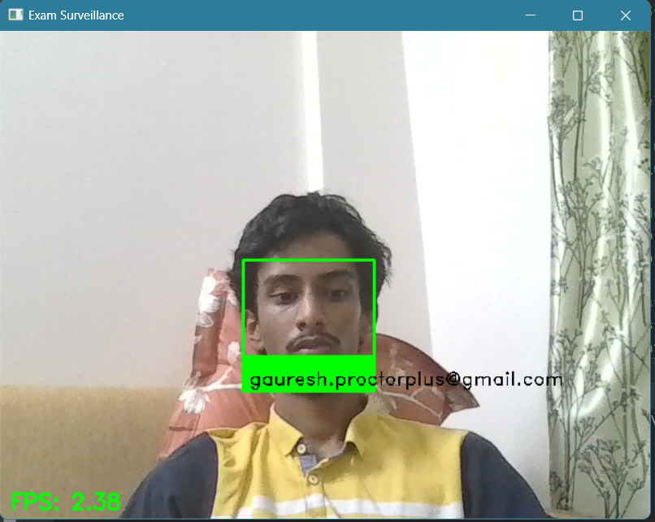
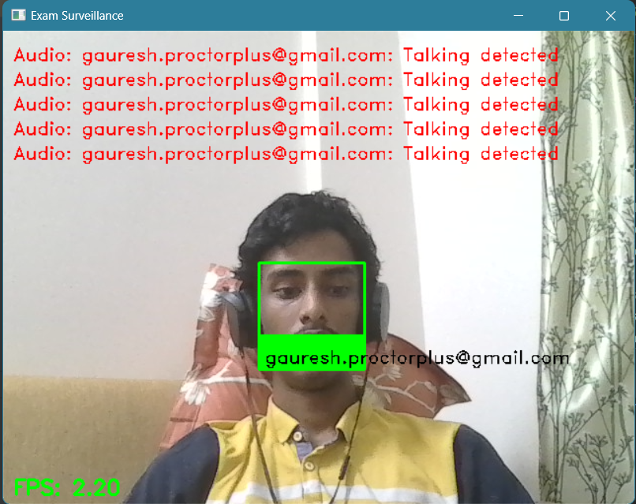

# ProctorPlus Surveillance Module

A complementory exam proctoring system that uses computer vision and audio monitoring to detect and prevent academic dishonesty during online examinations designned to be used along with CCTV footage of an exam centre.

## Features

- **Real-time Face Recognition**: Identifies registered students and detects unauthorized individuals
- **Gaze Tracking**: Monitors student eye movements to detect suspicious looking away from screen
- **Motion Detection**: Identifies suspicious movements or activities during examination
- **Audio Monitoring**: Detects potential verbal communication or suspicious sounds
- **Comprehensive Logging**: Records all violations with timestamps and student information
- **Video Recording**: Automatically records video footage when violations are detected
- **Database Integration**: Connects with PostgreSQL database for student verification

## Prerequisites

```bash
pip install opencv-python numpy face_recognition psycopg2-binary pyaudio requests
```

## Configuration

The system requires the following environment setup:

1. PostgreSQL database connection with student information
2. Webcam access for video monitoring
3. Microphone access for audio monitoring
4. Local media server for storing profile images

## Database Schema Requirements

The system uses database prepared for ProctorPlus

## Directory Structure

```
exam_surveillance_output/
├── logs/
│   ├── exam_proctor_[timestamp].log
│   └── violations_[timestamp].txt
├── violations/
└── recordings/
    └── exam_recording_[timestamp].avi
```

## Usage

```python
from proctor_surveillance import ComprehensiveExamProctor

proctor = ComprehensiveExamProctor()
proctor.run()
```

## Features Details

### Face Recognition
- Loads student face encodings from profile images
- Matches real-time video feed against known faces
- Marks unknown faces as potential violations

### Gaze Detection
- Monitors eye position and movement
- Detects when students look away from screen
- Configurable threshold for violation detection

### Motion Detection
- Tracks sudden movements in video feed
- Uses frame differencing for motion detection
- Configurable sensitivity threshold

### Audio Monitoring
- Runs in separate thread for continuous monitoring
- Detects sound levels above configurable threshold
- Flags potential verbal communication

## Violation Handling

The system logs various types of violations:
- Unknown person detection
- Suspicious gaze movement
- Excessive motion
- Audio disturbances

Each violation is:
1. Logged with timestamp and student information
2. Displayed on monitoring screen
3. Recorded in video format
4. Saved to violation log file

## Configuration Options

```python
config = {
    'fps_limit': 10,           # Frame processing rate
    'motion_threshold': 50,    # Motion detection sensitivity
    'gaze_threshold': 30,      # Degrees of acceptable eye movement
    'audio_threshold': 0.1,    # Audio detection threshold
    'face_tolerance': 0.6      # Face recognition tolerance level
}
```

## Security Considerations

- Secure database credentials storage
- Student privacy protection
- Video storage security
- Access control implementation

## Performance Optimization

- FPS limiting for CPU management
- Efficient frame processing
- Threaded audio monitoring
- Optimized face recognition

## Error Handling

The system includes comprehensive error handling for:
- Database connection issues
- Camera/audio device access
- Face recognition processing
- File I/O operations

## Implementation details:

Candidate recognition for ProctorPlus users


Suspicious activity flagging:


## Contributing

Guidelines for contributing:
1. Follow existing code style
2. Add tests for new features
3. Update documentation
4. Submit pull requests
